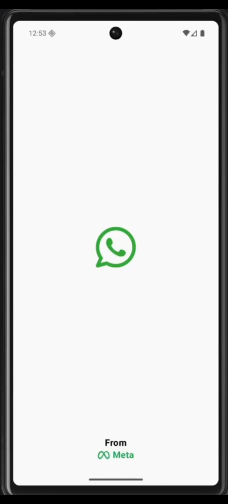
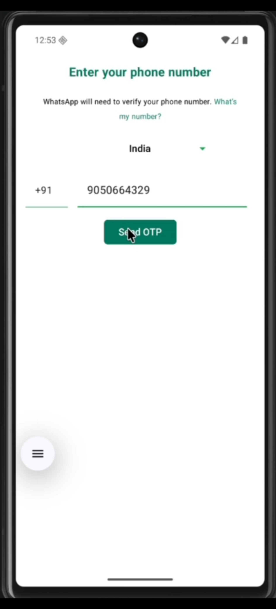
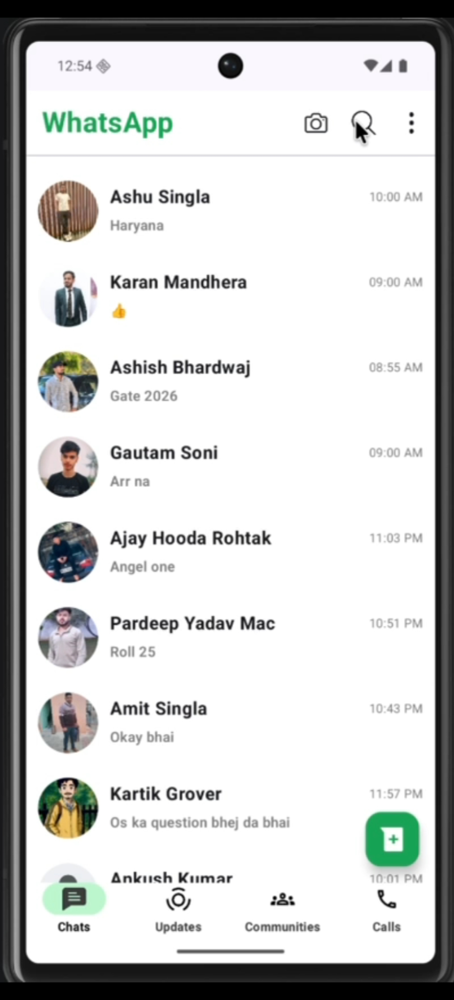
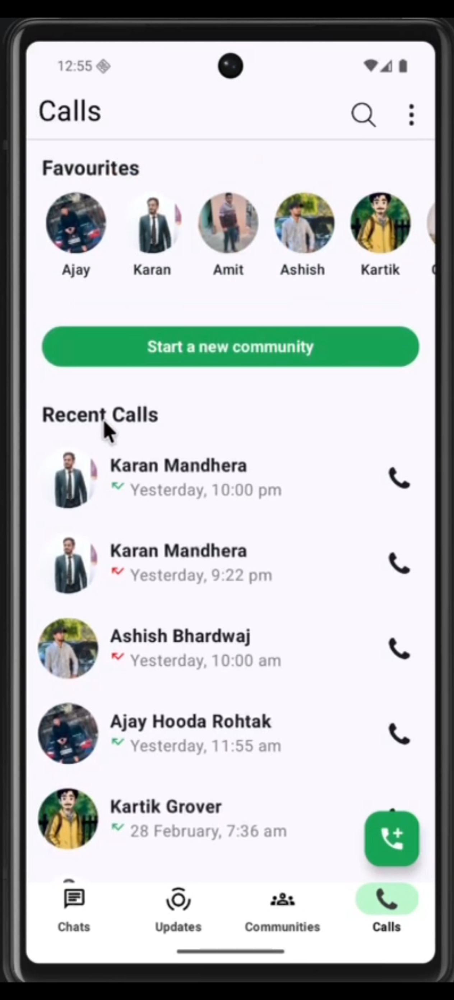
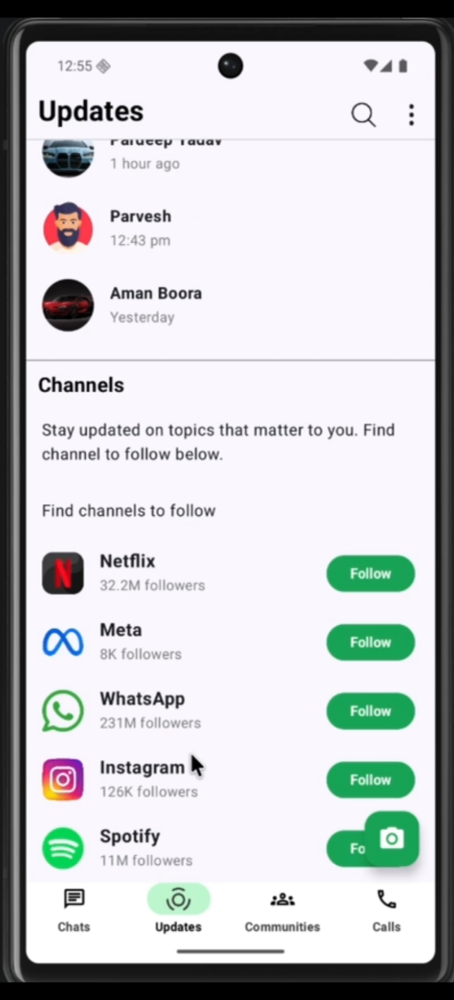
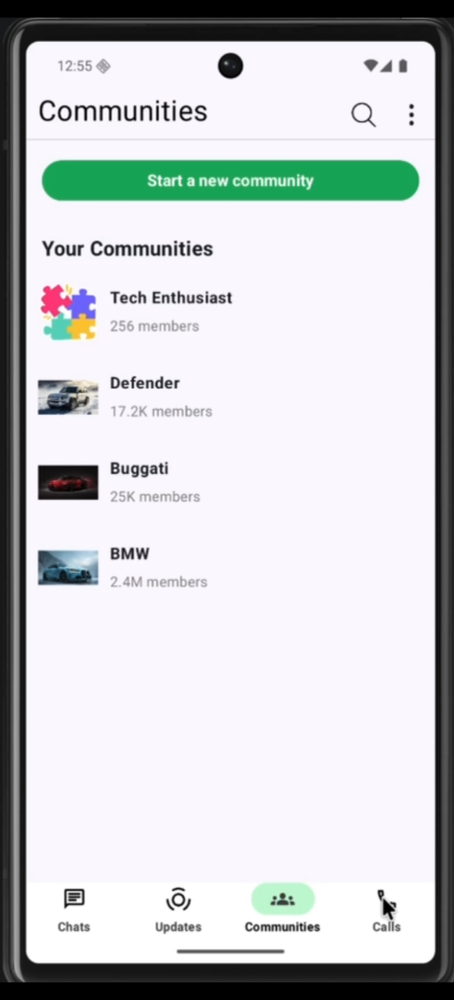
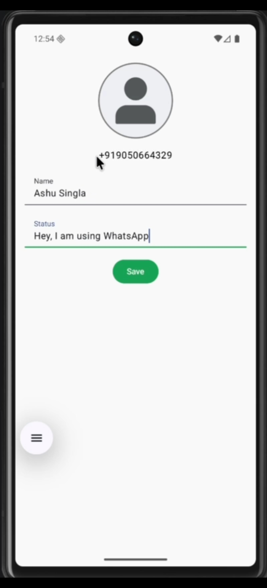

# 💬 WhatsApp Clone — Android

A feature-rich WhatsApp-inspired Android application built with **Jetpack Compose**, **Kotlin**, and **Firebase**. The app replicates the core WhatsApp experience including real-time messaging, phone number authentication, a calls screen, communities, and status updates — all with a modern, declarative UI.

---

## 📸 Screenshots

| Splash Screen | Welcome Screen | Registration |
|---|---|---|
|  |  |

| Home / Chats | Call Screen | Updates / Status |
|---|---|---|
|  |  |  |

| Communities | Profile |
|---|---|
|  |  |


---

## ✨ Features

- 📱 **Phone Number Authentication** — OTP-based login using Firebase Phone Auth
- 💬 **Real-time Messaging** — Instant chat powered by Firebase Realtime Database
- 🏘️ **Communities Screen** — Browse and view community channels
- 🔄 **Updates / Status Screen** — View channel updates and status items
- 👤 **User Profile** — Manage your profile details
- 🌊 **Splash & Welcome Screen** — Smooth onboarding experience
- 🧭 **Bottom Navigation** — Seamless navigation across all main sections
- 🎨 **Jetpack Compose UI** — Fully declarative, modern Android UI

---

## 🛠️ Tech Stack

| Technology | Purpose |
|---|---|
| **Kotlin** | Primary programming language |
| **Jetpack Compose** | Declarative UI toolkit |
| **Firebase Authentication** | OTP-based phone number sign-in |
| **Firebase Realtime Database** | Real-time message storage & syncing |
| **Hilt (Dependency Injection)** | App-level DI via `AppModule` |
| **ViewModel (MVVM)** | `BaseViewModel`, `PhoneAuthViewModel` |
| **Jetpack Navigation** | In-app navigation via `WhatsAppNavigationSystem` |

---

## 🏗️ Project Structure

```
com.example.whatsappclone/
│
├── di/
│   └── AppModule.kt                  # Hilt dependency injection module
│
├── model/
│   ├── Message.kt                    # Data model for chat messages
│   └── PhoneAuthUser.kt              # Data model for authenticated user
│
├── presentation/
│   ├── bottomnavigation/
│   │   ├── BottomNavigation.kt       # Bottom nav bar composable
│   │   └── NavigationItem.kt         # Nav item definitions
│   │
│   ├── callscreen/
│   │   ├── CallScreen.kt             # Main calls screen
│   │   ├── CallItemDesign.kt         # Individual call item UI
│   │   ├── CallItemData.kt           # Data model for calls
│   │   ├── FavouriteSection.kt       # Favourite contacts section
│   │   ├── FavouriteItems.kt         # Favourite item composable
│   │   ├── FavContactData.kt         # Data model for favourite contacts
│   │   └── TopBarCall.kt             # Top app bar for calls screen
│   │
│   ├── communitiesscreen/
│   │   ├── CommunitiesScreen.kt      # Main communities screen
│   │   ├── CommunityItemDesign.kt    # Community item UI
│   │   ├── CommunityData.kt          # Data model for communities
│   │   └── TopBarCommunity.kt        # Top app bar for communities
│   │
│   ├── homescreen/
│   │   ├── HomeScreen.kt             # Main chat list screen
│   │   ├── ChatListBox.kt            # Individual chat item UI
│   │   ├── ChatListModel.kt          # Data model for chat list
│   │   └── AddUserPopup.kt           # Popup to add a new user/chat
│   │
│   ├── updatescreen/
│   │   ├── UpdateScreen.kt           # Status & channel updates screen
│   │   ├── StatusItem.kt             # Status item composable
│   │   ├── StatusData.kt             # Data model for status
│   │   ├── ChannelItemDesign.kt      # Channel item UI
│   │   ├── ChannelData.kt            # Data model for channels
│   │   └── TopBar.kt                 # Top app bar for updates screen
│   │
│   ├── navigation/
│   │   ├── Routes.kt                 # Route definitions
│   │   └── WhatsAppNavigationSystem.kt # Navigation graph setup
│   │
│   ├── profile/                      # Profile screen
│   ├── splashscreen/                 # Splash screen
│   ├── welcomescreen/                # Welcome / onboarding screen
│   └── userregistrationscreen/       # Phone number registration screen
│
├── ui.theme/                         # App theme, colors, typography
│
├── viewmodel/
│   ├── BaseViewModel.kt              # Base class for ViewModels
│   └── PhoneAuthViewModel.kt         # ViewModel for phone authentication
│
├── MainActivity.kt                   # App entry point
└── WhatsAppCloneApplication.kt       # Hilt application class
```

---

## ⚙️ Installation & Setup

### Prerequisites

- Android Studio Hedgehog or newer
- Android SDK 26+
- A Firebase project

### 1. Clone the Repository

```bash
git clone https://github.com/Ashusingla90/whatsapp-clone-android.git
cd Whatsapp_clone
```

### 2. Connect Firebase

1. Go to [Firebase Console](https://console.firebase.google.com/) and create a new project
2. Add an **Android app** with package name `com.example.whatsappclone`
3. Download the `google-services.json` file
4. Place it inside the `/app` directory of the project

### 3. Enable Firebase Services

In your Firebase Console, enable the following:

- ✅ **Authentication** → Phone (enable Phone sign-in method)
- ✅ **Realtime Database** → Create database and set rules

Recommended Realtime Database rules for development:
```json
{
  "rules": {
    ".read": "auth != null",
    ".write": "auth != null"
  }
}
```

### 4. Add SHA-1 Key (Required for Phone Auth)

Phone authentication requires your app's SHA-1 fingerprint to be registered in Firebase.

Run this in your terminal from the project root:
```bash
./gradlew signingReport
```

Copy the **SHA-1** value and add it in:
**Firebase Console → Project Settings → Your Android App → Add Fingerprint**

### 5. Build & Run

Open the project in **Android Studio**, let Gradle sync, then click ▶️ **Run**.

---


## 📐 Architecture

This app follows the **MVVM (Model-View-ViewModel)** architecture pattern:

```
UI Layer (Jetpack Compose Screens)
            ↓
ViewModel Layer (PhoneAuthViewModel, BaseViewModel)
            ↓
Firebase Layer (Authentication + Realtime Database)
```

Dependency Injection is handled by **Hilt**, with the app-level module defined in `AppModule`.

---

## 🤝 Contributing

Contributions are welcome! Feel free to open an issue or submit a pull request.

1. Fork the project
2. Create your feature branch (`git checkout -b feature/AmazingFeature`)
3. Commit your changes (`git commit -m 'Add some AmazingFeature'`)
4. Push to the branch (`git push origin feature/AmazingFeature`)
5. Open a Pull Request

---


## 🙌 Acknowledgements

- Inspired by [WhatsApp](https://www.whatsapp.com/)
- Built with [Jetpack Compose](https://developer.android.com/jetpack/compose) & [Firebase](https://firebase.google.com/)
